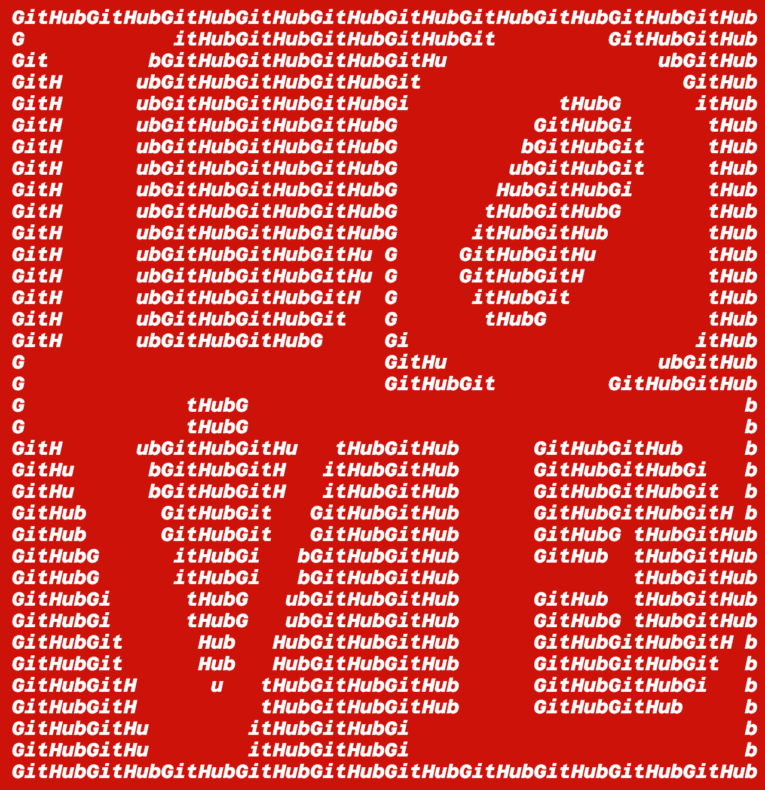

# Love Generator

This sketch reproduce Robert Indiana's ["Love"](https://en.wikipedia.org/wiki/Love_(image))
artwork with a message of your choice.

The code is an adaptation of David Ahl original BASIC code 'Love' printed in his book ["BASIC Computer Games"](https://en.wikipedia.org/wiki/BASIC_Computer_Games).